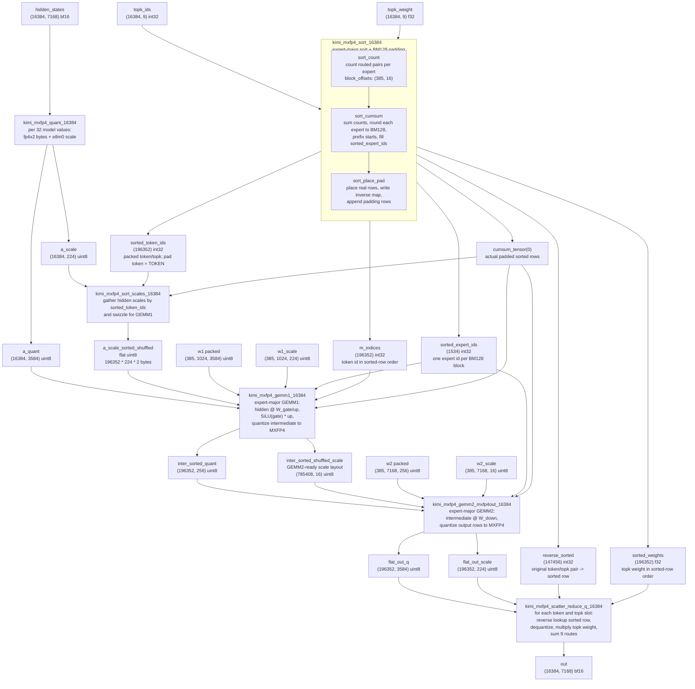
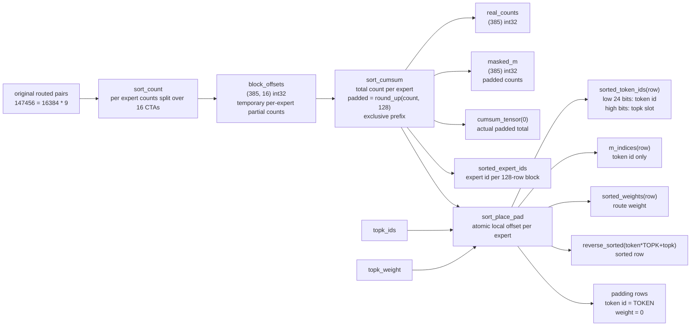
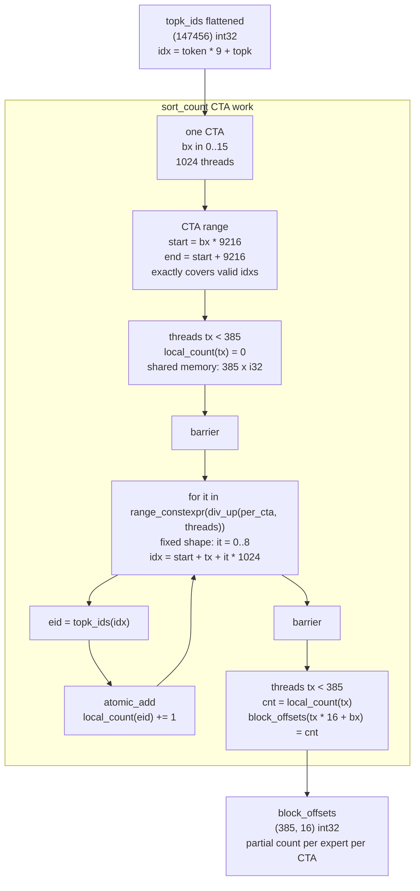
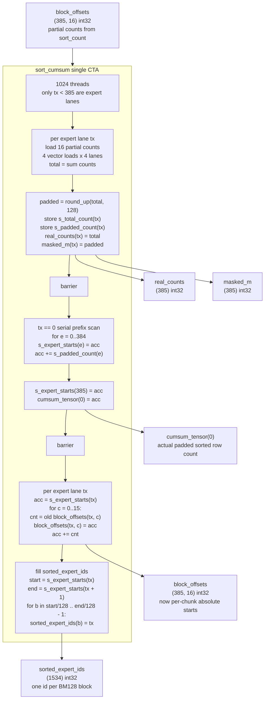
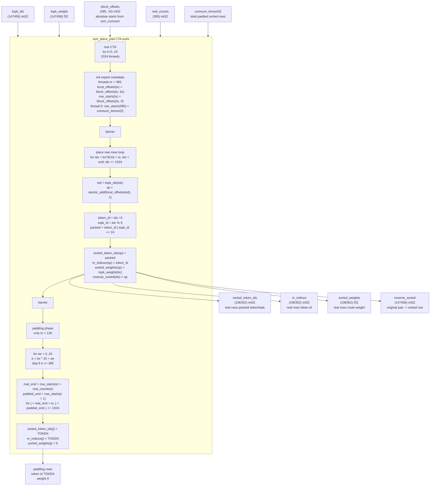
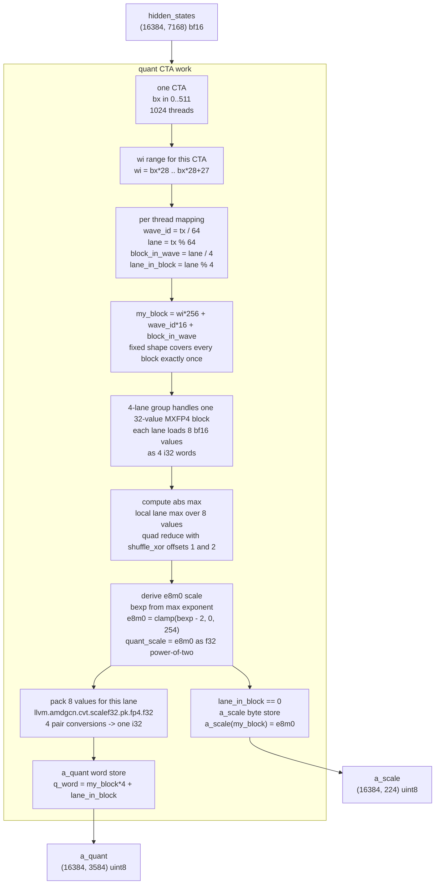
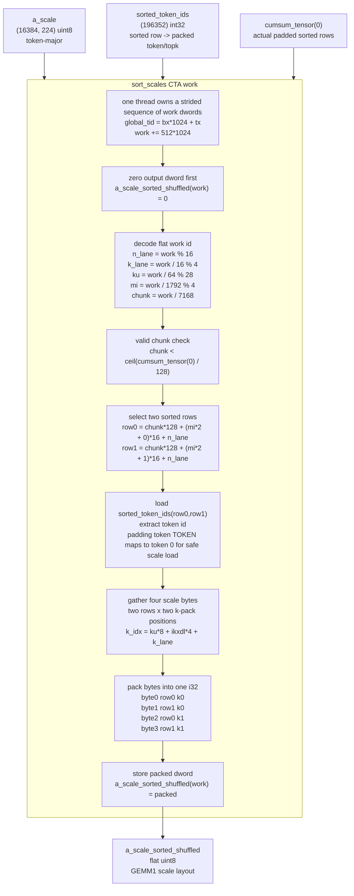

# Kimi FP4 MoE 16384 MXFP4 Flow

This note is a map for the current all-FlyDSL MXFP4 path in
`kimi_fp4_moe_16384_opt_simplify.py`, centered on:

```python
run_kimi_fp4_mxfp4_moe_16384_all_flydsl(...)
```

It is meant as a reading guide. The detailed GEMM scheduling, MFMA tiling, and
LDS pipeline are still in the kernel code; this document focuses on which
buffers exist, how rows are rearranged, and why the final scatter/reduce is
needed.

## Fixed Shape

| name | value |
| --- | ---: |
| `TOKEN` | 16384 |
| `TOPK` | 9 |
| `EXPERTS` | 385 |
| `MODEL_DIM` | 7168 |
| `INTER_DIM` | 512 |
| `MXFP4_BLOCK_M` | 128 |
| routed pairs before padding | `TOKEN * TOPK = 147456` |
| worst-case padded sorted rows | `max_sorted = 196352` |
| sorted expert blocks | `max_sorted / 128 = 1534` |

MXFP4 storage convention in this file:

| logical data | packed value shape | scale shape |
| --- | --- | --- |
| hidden `[TOKEN, MODEL_DIM]` | `[16384, 3584]` uint8 | `[16384, 224]` uint8 |
| intermediate `[sorted, INTER_DIM]` | `[196352, 256]` uint8 | logical `[196352, 16]`, but stored in GEMM2 shuffled layout |
| output per routed row `[sorted, MODEL_DIM]` | `[196352, 3584]` uint8 | `[196352, 224]` uint8 |

## Stage Count vs Kernel Count

There are 6 high-level Python stages in `run_kimi_fp4_mxfp4_moe_16384_all_flydsl`,
but 8 actual GPU kernel launches. The difference is that the first stage,
`kimi_mxfp4_sort_16384`, launches three kernels internally.

| high-level stage | actual GPU launches |
| --- | --- |
| 1. `kimi_mxfp4_sort_16384` | `sort_count`, `sort_cumsum`, `sort_place_pad` |
| 2. `kimi_mxfp4_quant_16384` | `quant` |
| 3. `kimi_mxfp4_sort_scales_16384` | `sort_scales` |
| 4. `kimi_mxfp4_gemm1_16384` | `gemm1` |
| 5. `kimi_mxfp4_gemm2_mxfp4out_16384` | `gemm2_mxfp4out` |
| 6. `kimi_mxfp4_scatter_reduce_q_16384` | `scatter_reduce_q` |

So if "kernel" means Python wrapper stage, there are 6. If it means GPU launch,
there are 8.

## Main Dataflow



## Sort Internals

The sort stage converts row order from token-major routing:

```text
original pair index = token_id * TOPK + topk_slot
```

to expert-major, BM128-padded rows:

```text
sorted rows = expert 0 rows, expert 0 padding,
              expert 1 rows, expert 1 padding,
              ...
```



Three buffers are easy to confuse:

| buffer | direction | used by |
| --- | --- | --- |
| `sorted_token_ids[row]` | sorted row -> packed `(token, topk)` | `sort_scales`, padding checks |
| `m_indices[row]` | sorted row -> token id | GEMM1 A-row lookup |
| `reverse_sorted[token * TOPK + topk]` | original routed pair -> sorted row | final scatter/reduce |

## Kernel 1: `sort_count`

The first actual GPU launch is:

```python
sort_count(topk_ids, block_offsets).launch(
    grid=(16, 1, 1),
    block=(1024, 1, 1),
)
```

Its job is only to count how many routed pairs in each CTA chunk go to each
expert. It does not place rows yet.

Fixed constants:

| item | value |
| --- | ---: |
| total routed pairs | `16384 * 9 = 147456` |
| `sort_ctas` | 16 |
| threads per CTA | 1024 |
| routed pairs per CTA chunk | `147456 / 16 = 9216` |
| exact coverage check | `147456 % 16 == 0`, `9216 % 1024 == 0` |
| loop expression in code | `range_constexpr(div_up(per_cta, threads))` |
| loop iterations per thread, fixed shape | `ceil(9216 / 1024) = 9` |
| experts | 385 |
| output entries | `385 * 16 = 6160` |



Equivalent scalar pseudocode:

```python
for bx in parallel_range(16):
    local_count = [0] * 385

    start = bx * 9216
    end = start + 9216

    for tx in parallel_range(1024):
        for it in range_constexpr(div_up(per_cta, threads)):  # 9 for this shape
            idx = start + tx + it * 1024
            eid = topk_ids[idx]
            atomic_add(local_count[eid], 1)

    for expert in parallel_range(385):
        block_offsets[expert, bx] = local_count[expert]
```

The output layout is expert-major:

```text
block_offsets[e, bx] = count of routes to expert e inside CTA chunk bx
flat offset           = e * 16 + bx
```

## Kernel 2: `sort_cumsum`

The second actual GPU launch is:

```python
sort_cumsum(
    block_offsets,
    masked_m,
    real_counts,
    cumsum_tensor,
    sorted_expert_ids,
).launch(
    grid=(1, 1, 1),
    block=(1024, 1, 1),
)
```

Its job is to turn the per-CTA partial counts from `sort_count` into global
row ranges for each expert. This is the kernel that decides the padded sorted
layout.

Inputs and outputs:

| buffer | before `sort_cumsum` | after `sort_cumsum` |
| --- | --- | --- |
| `block_offsets(e, c)` | count of expert `e` in CTA chunk `c` | absolute row start for expert `e`, CTA chunk `c` |
| `real_counts(e)` | uninitialized | true routed count for expert `e` |
| `masked_m(e)` | uninitialized | BM128-padded count for expert `e` |
| `cumsum_tensor(0)` | uninitialized | total padded sorted rows |
| `sorted_expert_ids(b)` | uninitialized | expert id for BM128 block `b` |

```text
real_count(e) = sum(block_offsets(e, 0:16))
padded(e)     = round_up(real_count(e), 128)
start(e)      = sum_{k < e} padded(k)
end(e)        = start(e) + padded(e)
```



Equivalent scalar pseudocode:

```python
# Parallel across expert lanes tx = 0..384.
for e in parallel_range(385):
    total = 0
    for c in range_constexpr(16):
        total += block_offsets[e, c]

    padded = round_up(total, 128)
    s_total_count[e] = total
    s_padded_count[e] = padded
    real_counts[e] = total
    masked_m[e] = padded

barrier()

# One thread computes the expert prefix ranges.
acc = 0
for e in range(385):
    s_expert_starts[e] = acc
    acc += s_padded_count[e]
s_expert_starts[385] = acc
cumsum_tensor[0] = acc

barrier()

# Parallel across expert lanes again.
for e in parallel_range(385):
    acc = s_expert_starts[e]
    for c in range_constexpr(16):
        cnt = block_offsets[e, c]
        block_offsets[e, c] = acc
        acc += cnt

    for b in range(s_expert_starts[e] // 128, s_expert_starts[e + 1] // 128):
        sorted_expert_ids[b] = e
```

The key mutation is `block_offsets`:

```text
before: block_offsets(e, c) = local count from sort_count CTA c
after:  block_offsets(e, c) = absolute start row for sort_place_pad CTA c
```

## Kernel 3: `sort_place_pad`

The third actual GPU launch is:

```python
sort_place_pad(
    topk_ids,
    topk_weight,
    block_offsets,
    real_counts,
    cumsum_tensor,
    sorted_token_ids,
    reverse_sorted,
    sorted_weights,
    m_indices,
).launch(
    grid=(16, 1, 1),
    block=(1024, 1, 1),
)
```

This is the kernel that actually writes the sorted row buffers. It consumes the
absolute starts produced by `sort_cumsum`, places all real routed pairs, then
fills each expert's BM128 padding rows.

Fixed constants:

| item | value |
| --- | ---: |
| `sort_ctas` | 16 |
| threads per CTA | 1024 |
| routed pairs per CTA chunk | 9216 |
| place-loop iterations per thread | 9 |
| `experts_per_cta` for padding | `ceil(385 / 16) = 25` |
| padding lanes | 128 |



Equivalent scalar pseudocode:

```python
for bx in parallel_range(16):
    # Shared state for this CTA.
    for e in parallel_range(385):
        local_offsets[e] = block_offsets[e, bx]
        row_starts[e] = block_offsets[e, 0]
    row_starts[385] = cumsum_tensor[0]

    barrier()

    # Place real routed pairs from this CTA chunk.
    start = bx * 9216
    end = min(start + 9216, 147456)
    for tx in parallel_range(1024):
        for idx in range(start + tx, end, 1024):
            eid = topk_ids[idx]
            sp = atomic_add(local_offsets[eid], 1)

            token_id = idx // 9
            topk_id = idx % 9
            packed = (token_id & 0x00FFFFFF) | (topk_id << 24)

            sorted_token_ids[sp] = packed
            m_indices[sp] = token_id
            sorted_weights[sp] = topk_weight[idx]
            reverse_sorted[idx] = sp

    barrier()

    # Fill padding rows for up to 25 experts assigned to this CTA.
    for tx in parallel_range(128):
        for ee in range_constexpr(25):
            e = bx * 25 + ee
            if e < 385:
                real_end = row_starts[e] + real_counts[e]
                padded_end = row_starts[e + 1]
                for j in range(real_end + tx, padded_end, 1024):
                    sorted_token_ids[j] = TOKEN
                    m_indices[j] = TOKEN
                    sorted_weights[j] = 0.0
```

After this kernel, the sort stage is complete:

| output | meaning |
| --- | --- |
| `sorted_token_ids(row)` | sorted-row order, packed token/topk; padding rows use token `TOKEN` |
| `m_indices(row)` | sorted-row order token id, consumed by GEMM1 |
| `sorted_weights(row)` | sorted-row order route weight, consumed by scatter/reduce |
| `reverse_sorted(orig)` | token-major original route index -> sorted row, consumed by scatter/reduce |

## Kernel 4: `quant`

The fourth actual GPU launch is:

```python
quant(hidden, a_quant, a_scale).launch(
    grid=(512, 1, 1),
    block=(1024, 1, 1),
)
```

This kernel quantizes the original bf16 hidden matrix into MXFP4. It does not
use the sorted row order yet.

Work unit:

```text
one MXFP4 block = 32 consecutive hidden values
one MXFP4 block produces 16 packed fp4 bytes + 1 e8m0 scale byte
```

Fixed constants:

| item | value |
| --- | ---: |
| hidden shape | `(16384, 7168)` bf16 |
| blocks per token | `7168 / 32 = 224` |
| total MXFP4 blocks | `16384 * 224 = 3670016` |
| CTAs | 512 |
| threads per CTA | 1024 |
| waves per CTA | `1024 / 64 = 16` |
| MXFP4 blocks per wave | `64 / 4 = 16` |
| MXFP4 blocks per CTA iteration | `16 * 16 = 256` |
| CTA iterations | `3670016 / (512 * 256) = 28` |



Equivalent scalar pseudocode:

```python
for bx in parallel_range(512):
    for wi in range(bx * 28, bx * 28 + 28):
        for tx in parallel_range(1024):
            wave_id = tx // 64
            lane = tx % 64
            block_in_wave = lane // 4
            lane_in_block = lane % 4

            my_block = wi * 256 + wave_id * 16 + block_in_wave

            # The code still has a my_block < total_blocks guard, but this
            # fixed shape covers exactly 3670016 blocks.
            base = my_block * 32 + lane_in_block * 8
            vals = load_8_bf16_values(hidden_states, base)

            local_amax = max(abs(vals))
            block_amax = quad_reduce_max(local_amax)
            e8m0 = clamp(exponent(block_amax) - 2, 0, 254)
            quant_scale = e8m0_to_f32_scale(e8m0)

            packed_i32 = pack_8_values_to_fp4(vals, quant_scale)
            a_quant_words[my_block * 4 + lane_in_block] = packed_i32

            if lane_in_block == 0:
                a_scale[my_block] = e8m0
```

Output layout:

| output | meaning |
| --- | --- |
| `a_quant(token, model_byte)` | packed fp4 hidden values; two fp4 values per byte |
| `a_scale(token, model_block32)` | one e8m0 scale per 32 hidden values |

## Kernel 5: `sort_scales`

The fifth actual GPU launch is:

```python
sort_scales(
    a_scale,
    sorted_token_ids,
    cumsum_tensor,
    a_scale_sorted_shuffled,
).launch(
    grid=(512, 1, 1),
    block=(1024, 1, 1),
)
```

This kernel gathers the token-major activation scales into the shuffled layout
that GEMM1 expects. `a_quant` itself is not sorted; GEMM1 uses `m_indices` to
load token rows. The scales are sorted and swizzled ahead of time because the
MFMA scale path consumes them in a compact packed order.

Fixed constants:

| item | value |
| --- | ---: |
| input `a_scale` | `(16384, 224)` uint8 |
| sorted chunks | `max_sorted / 128 = 1534` |
| scale columns per token | `7168 / 32 = 224` |
| row groups per BM128 chunk | `c_m1 = 4` |
| K groups | `c_k1 = 28` |
| output dwords per chunk | `4 * 28 * 4 * 16 = 7168` |
| total work dwords | `1534 * 7168 = 10995712` |
| launch threads | `512 * 1024 = 524288` |
| loop trips per thread upper bound | `ceil(10995712 / 524288) = 21` |
| output bytes | `196352 * 224 * 2 = 87965696` |



Equivalent scalar pseudocode:

```python
actual_sorted = cumsum_tensor[0]
actual_n_chunks = ceil(actual_sorted / 128)

for work in parallel_strided_range(total_work, stride=512 * 1024):
    a_scale_sorted_shuffled_dwords[work] = 0

    n_lane = work % 16
    k_lane = (work // 16) % 4
    ku = (work // 64) % 28
    mi = (work // (16 * 4 * 28)) % 4
    chunk = work // (16 * 4 * 28 * 4)

    if chunk < actual_n_chunks:
        packed = 0

        tok_ids = []
        for im_a in range_constexpr(2):
            sorted_row = chunk * 128 + (mi * 2 + im_a) * 16 + n_lane
            packed_token_topk = sorted_token_ids[sorted_row]
            token = packed_token_topk & 0x00FFFFFF
            token = token if token < TOKEN else 0
            tok_ids.append(token)

        for ikxdl in range_constexpr(2):
            for im_a in range_constexpr(2):
                k_idx = ku * 8 + ikxdl * 4 + k_lane
                byte = a_scale[tok_ids[im_a], k_idx]
                packed |= byte << ((ikxdl * 2 + im_a) * 8)

        a_scale_sorted_shuffled_dwords[work] = packed
```

The packed output is deliberately not a readable `(sorted_row, scale_col)`
matrix. It is a GEMM1 input stream arranged to match the later
`mfma_scale_f32_16x16x128_f8f6f4` scale operand pattern.

## Stage Notes

### 1. Quantize Hidden

`kimi_mxfp4_quant_16384(hidden_states)` reads bf16 hidden states in original
token order and writes:

```text
a_quant: (TOKEN, MODEL_DIM / 2)  = (16384, 3584)
a_scale: (TOKEN, MODEL_DIM / 32) = (16384, 224)
```

Each scale covers 32 bf16 values. The data is still token-major at this point.

### 2. Sort Scales

`a_quant` is not physically sorted before GEMM1. GEMM1 uses `m_indices` to
lookup the source token row. The scale layout is different: GEMM1 expects a
GEMM-friendly shuffled scale stream, so `kimi_mxfp4_sort_scales_16384` gathers
`a_scale[token]` through `sorted_token_ids` and writes
`a_scale_sorted_shuffled`.

The output is not a plain matrix. The wrapper allocates:

```text
padded_rows * (MODEL_DIM / 32) * 2
= 196352 * 224 * 2 bytes
```

### 3. GEMM1

`kimi_mxfp4_gemm1_16384` works in sorted expert-major row order:

```text
for each sorted BM128 block:
    expert = sorted_expert_ids[block]
    token rows = m_indices[sorted rows]
    load hidden MXFP4 from a_quant[token]
    load W_gate and W_up for expert
    compute gate/up
    compute SiLU(gate) * up
    quantize intermediate to MXFP4
```

Outputs:

```text
inter_sorted_quant:          (196352, 256) uint8
inter_sorted_shuffled_scale: (785408, 16) uint8
```

`inter_sorted_shuffled_scale` is already in the scale layout expected by GEMM2,
so it is larger than the logical `(196352, 16)` scale matrix.

### 4. GEMM2 MXFP4OUT

`kimi_mxfp4_gemm2_mxfp4out_16384` keeps the sorted row order:

```text
inter_sorted_quant @ W_down[expert]
```

It does not reduce TOPK and it does not write bf16 staging. It writes an MXFP4
output row per sorted routed row:

```text
flat_out_q:     (196352, 3584) uint8
flat_out_scale: (196352, 224) uint8
```

This is the important difference from the older bf16 staging path. The older
path materialized `[TOKEN, TOPK, MODEL_DIM]` bf16 and then called `torch.sum`.
This path keeps output packed and delays the weighted TOPK reduce to the next
kernel.

### 5. Scatter/Reduce

`kimi_mxfp4_scatter_reduce_q_16384` switches back to token-major output order.
For each token and output column group, it walks `TOPK=9` routes:

```text
orig = token * TOPK + topk_slot
sorted_row = reverse_sorted[orig]
weight = sorted_weights[sorted_row]
value = dequant(flat_out_q[sorted_row], flat_out_scale[sorted_row])
acc += value * weight
```

The final result is:

```text
out: (16384, 7168) bf16
```

## Reading Order In Code

Use this order if you want to understand or edit the file:

1. `run_kimi_fp4_mxfp4_moe_16384_all_flydsl`
2. `kimi_mxfp4_sort_16384`
3. `compile_kimi_mxfp4_sort_16384`
4. `kimi_mxfp4_quant_16384`
5. `kimi_mxfp4_sort_scales_16384`
6. `kimi_mxfp4_gemm1_16384`
7. `kimi_mxfp4_gemm2_mxfp4out_16384`
8. `kimi_mxfp4_scatter_reduce_q_16384`

When debugging correctness, keep these invariants in mind:

| invariant | why it matters |
| --- | --- |
| `cumsum_tensor[0] <= max_sorted` | actual padded rows must fit allocated buffers |
| `sorted_expert_ids` is per BM128 block | GEMM kernels pick expert weights by block |
| padding token id is `TOKEN` | GEMM kernels can guard invalid rows |
| `reverse_sorted` maps original pair to sorted row | scatter/reduce needs original token-major route order |
| `sorted_weights` is sorted-row aligned | final reduce multiplies each decoded row by the route weight |
