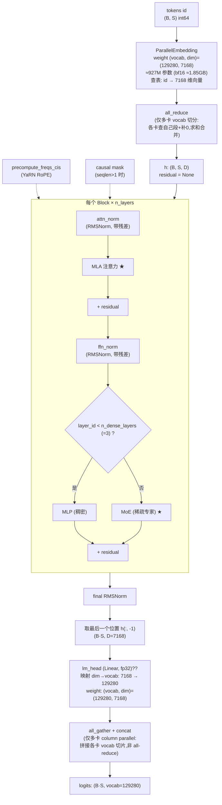
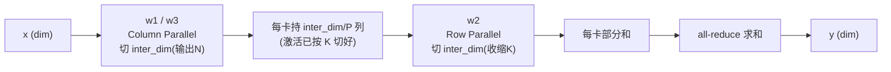
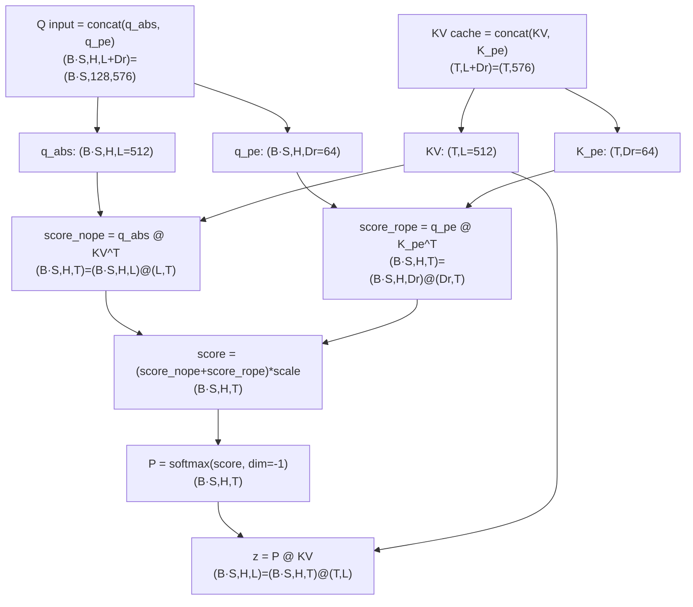
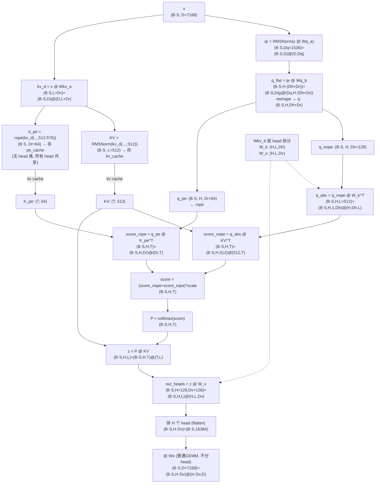
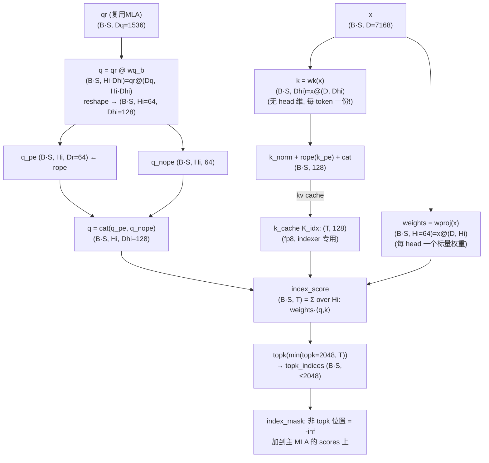
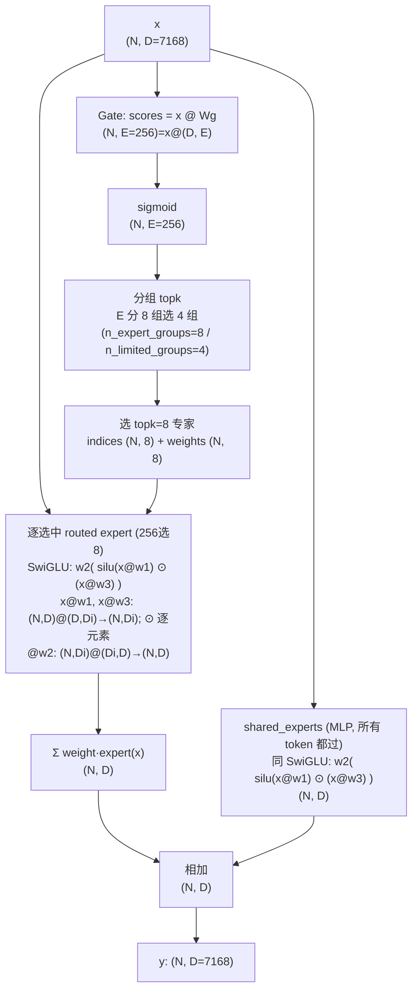
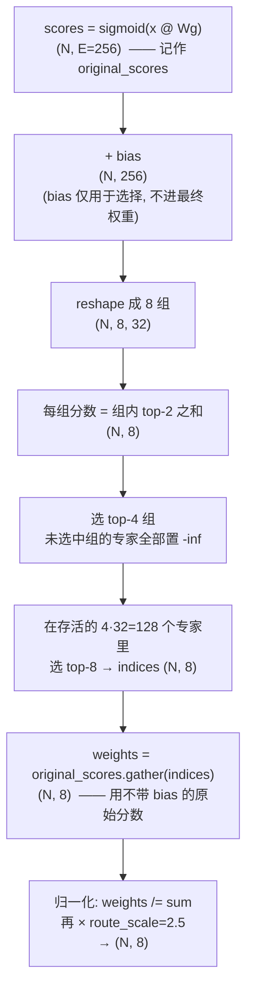

本文基于 `model.py` https://huggingface.co/deepseek-ai/DeepSeek-V3.2/blob/main/inference/model.py 中的 `Transformer.forward`,自顶向下梳理一次推理(前向)的完整数据流。

---

## 1. Transformer forward.

记号(ds3.2 实际值):
- `S` 序列长度 query 每步仅 `1` 个 token(decode) / MTP(n个)
- `B` batchsize
- `D = 7168` 隐藏维(hidden / d_model)





> 残差是"预归一化"形式:`x, residual = norm(x, residual)`,残差流贯穿所有 block。

### 1.1 p.s. Column Parallel vs Row Parallel

以 Megatron 约定 `Y = X · A`(权重 `A` 形状记作 `[in, out]`):

| 类型                  | 切权重哪一维                                 | 每卡输出          | 卡间通信              |
| ------------------- | -------------------------------------- | ------------- | ----------------- |
| **Column Parallel** | 切 **out**(N,输出维)`A = [A₁ ¦ A₂]`        | 一段列,可直接拼接/续接  | 无(本层不通信)          |
| **Row Parallel**    | 切 **in**(K,收缩维)`A = [A₁ ; A₂]`,且 X 按列切 | "部分和" `Xᵢ·Aᵢ` | **all-reduce 求和** |


column是第一步，row是第二步（类似split-k, 然后之后要接 all-reduce)




---

## 2. MLA + indexer

### 2.1 decode 前向的 shape 流


- `Dq = 1536` query 低秩维(q_lora_rank)
- `H = 128` head 数
- `Dh = 128` nope 维(qk_nope_head_dim)
- `Dr = 64` rope 维(qk_rope_head_dim)
- `Dv = 128` value head 维(v_head_dim)
- `L = 512` 潜变量维(kv_lora_rank)
- `T` = KV 序列长度(cache 里已有的 token 数 / 当前上下文长度)

> 注意 `H` 和 `Dh` 都是 128,别混
>
> 下图统一采用行向量约定 `Y = X @ W`,因此权重形状写作 `[in, out]`。
> PyTorch `Linear.weight` 实际按 `[out, in]` 存储,阅读源码中的 `view/einsum` 时会看到相反的轴顺序。
  




矩阵命名和作用:

- `Wq_a`(`W^DQ`):Query down projection,把 `D` 压缩到 query latent `Dq`。
- `Wq_b`(打包 `W^UQ/W^QR`):Query up projection,把 `Dq` 展开成每个 head 的 `q_nope/q_rope`。
- `Wkv_a`(打包 `W^DKV/W^KR`):生成共享 KV latent `c` 和共享的 RoPE key。
- `Wkv_b`(打包 `W^UK/W^UV`):把 `c` 展开成每个 head 的 non-RoPE key/value；`W_k/W_v` 是它的两个切片,不是独立参数。

decode 时不会为所有历史 token 显式展开 K/V:

- Key 侧利用 `q_nope @ (C @ W_k)^T = (q_nope @ W_k^T) @ C^T`,把 `W_k` 移到当前 Query 侧。
- Value 侧利用 `a @ (C @ W_v) = (a @ C) @ W_v`,先得到 latent context `z=a@C`,再应用 `W_v`。

这里的 DeepSeek 参考实现只是把 `W_v` 移到 attention reduction 之后,随后仍单独执行 `W_v` 和 `Wo`,并未预先把二者融合。当前 FlyDSL MLA kernel 对应从吸收后的 `q_abs/C` 计算到 `z=a@C`,不包含 `Wq_a/Wq_b/W_k/W_v/Wo`。


非矩阵吸收： 
Q   = x @ Wq_a @ Wq_b
    = [B, 7168] @ [7168, 1536] @ [1536, 128*(128+64)]
    = [B, 128, 192]
    = [B, 128, ql=1, 192]

KV  = x @ Wkv_a @ Wkv_b
    = [B, 7168] @ [7168, 512] @ [512, 128, 256] 
    = [B, T, 128, 128 + 128]
    = K_nope: [B, T, 128, 128] 
      + V: [B, T, 128, 128]   

K_rope =
       [B, T, 64]
K   = cat(K_nope, K_rope)
    = [B, T, 128, 192]
    = [B, 128, 192, T]

Q@K = [B, 128, T]
P = softmax(scores=Q@K)
out = [B, 128, 1, T] @ [B, T, 128, 128]
    = [B, 128, 1, 128]

#### 非矩阵吸收的完整计算(补上 RoPE、softmax 和 qlen 维)

上面的 `Q @ K` 已经把 RoPE 部分包含在最后的 `192=Dh+Dr` 维里,但完整流程需要先分别生成
NoPE/RoPE 分量并对 RoPE 分量执行旋转。下面保留 `Q=qlen=1` 这一维,并统一将 head 放在第二维。

Query 路径:

```text
x_q       : [B, Q=1, 7168]
q_latent  = RMSNorm(x_q @ Wq_a)
          : [B, 1, 1536]

q_flat    = q_latent @ Wq_b
          : [B, 1, 128, 128+64]

q         = reshape + permute(q_flat)
          : [B, 128, 1, 128+64]

q_nope, q_rope_raw = split(q, [128, 64], dim=-1)

q_rope    = RoPE(q_rope_raw, query_position)
          : [B, 128, 1, 64]

return q_nope q_rope
```

KV 路径(非吸收路径会显式执行 `Wkv_b`,展开每个 head 的 K/V):

```text
x_kv      : [B, T, 7168]
kv_a      = x_kv @ Wkv_a [7168, 512+64]
          : [B, T, 512+64]

c_raw, k_rope_raw = split(kv_a, [512, 64], dim=-1)
C         = RMSNorm(c_raw)                  : [B, T, 512]
k_rope    = RoPE(k_rope_raw, kv_positions)  : [B, T, 64]  # TODO, query_position & kv_positions有什么不同？

if not 吸收：
    kv_up     = C @ Wkv_b
              : [B, T, 512] @ [512, 128*(128+128)]
              : [B, T, 128, 128+128]

    k_nope, V = split(kv_up, [128, 128], dim=-1)
    k_nope    : [B, 128, T, Dh=128]  (permute 后)
    V         : [B, 128, T, Dv=128]  (permute 后)

    k_rope    : [B, T, 64]
    broadcast : [B, 128, T, 64]       (所有 head 共享同一份 k_rope)
else:
    q_abs = q_nope @ Wkv_b = [B, 128, 1, 128] @ [512, 128, 128 + 64] ? 不对, wkv_b需要拆开么？非rope & rope?
    i     : [B, 128, 1, 128] @ [128, 128, 512]
          : [B, 128, 1, 512]
    
    score_nope = q_abs @ C^T
          : [B, 128, 1, 512] @ [B, 512, T]
          : [B, 128, 1, T]
```

RoPE 只作用于 `q_rope_raw/k_rope_raw` 的 64 维。把每相邻两个元素看作一对,在位置 `p` 上执行旋转:

```text
y[2i]   = x[2i]   * cos(theta[p,i]) - x[2i+1] * sin(theta[p,i])
y[2i+1] = x[2i]   * sin(theta[p,i]) + x[2i+1] * cos(theta[p,i])
```

QK score 可以先拼接再点积,也可以像实际实现一样分两部分计算后相加；两者完全等价:

```text
q_full = cat(q_nope, q_rope)  : [B, H, 1, Dh+Dr=192]
k_full = cat(k_nope, k_rope)  : [B, H, T, Dh+Dr=192]

scores = q_full @ k_full^T
       : [B, H, 1, 192] @ [B, H, 192, T]
       : [B, H, 1, T]
```

等价的拆分写法:

```text
score_nope = q_nope @ k_nope^T  : [B, H, 1, T]
score_rope = q_rope @ k_rope^T  : [B, H, 1, T]

scores = (score_nope + score_rope) * softmax_scale
softmax_scale = 1 / sqrt(Dh + Dr) = 1 / sqrt(192)  # 不考虑 YaRN 的额外修正
```

如果有 causal/sparse mask,在 softmax 前将不允许关注的位置加上 `-inf`。decode `Q=1` 且 cache
只包含当前及历史有效位置时,通常不需要额外 causal mask。

softmax 对每个 `(batch, head, query)` 独立地沿 KV 序列维 `T` 归一化:

```text
row_max = max(scores, dim=T, keepdim=True)
exp_s   = exp(scores - row_max)
P       = exp_s / sum(exp_s, dim=T, keepdim=True)
        : [B, H, 1, T]
```

最后使用概率 `P` 对同一个 head 的 Value 沿 `T` 加权求和:

```text
out_heads = P @ V
          : [B, H, 1, T] @ [B, H, T, 128]
          : [B, H, 1, 128]

out_flat  = reshape/permute(out_heads)
          : [B, 1, 128 * 64]

out       = out_flat @ Wo
          : [B, 1, 128 * 64] @ [128 * 64, 7168]
          : [B, 1, 7168]
```

### 2.2 Indexer(DSA 稀疏注意力的"选 token"器)

- **Indexer** 是 V3.2 新增的稀疏注意力:先算 index_score 选 topk 个位置,再把非 topk 的位置在 scores 里置 `-inf`,即只对最相关的 token 做注意力。

作用:为每个 query 便宜地选出最相关的 `≤ index_topk=2048` 个历史 token,主 MLA 只对这些算注意力(其余位置在 scores 里置 `-inf`)。

- `Hi = 64` index head 数(index_n_heads)
- `Dhi = 128` index head 维(index_head_dim)
- `topk = 2048`(index_topk)

> 注意:indexer **复用 MLA 的 query 低秩 `qr (B·S, Dq)`**,且 **k 每 token 只有一份(不分 head)**。



要点:

- **比主 MLA 便宜一个量级**:全 fp8、head 更少(`Hi=64`)、且 **k 不分 head**(每 token 仅 128 维),所以拿来"选 token"很划算。
- 打分公式:`index_score[q, t] = Σ_head weights[q,head] · ⟨q[q,head], k[t]⟩`,每个 query 对 T 个候选打分后取 top 2048(`model.py` 478–483 行)。

> 注：这里是按照example中的写法，真实推理中模型肯定会根据indexer 选 kvcache 来做推理的. indexer 现在这样当 mask 只是演示下正确性

---

## 3. MoE 内部(稀疏专家路由)

记号:

- `N = B·S` token 数
- `D = 7168` 隐藏维
- `E = 256` 路由专家数(n_routed_experts)
- 激活 `8` 个(n_activated_experts)
- `1` 个 shared expert(n_shared_experts)
- `Di = 2048` 专家中间维(moe_inter_dim)




要点:每个 token 只激活 `n_activated_experts` 个路由专家 + 固定的 `shared_experts`,这就是"稀疏激活、低推理成本"的来源(`model.py` 780–804 行)。

### 3.1 Gate 的分组 topk 选择(256 选 8)

ds3.2:256 个专家分成 `n_expert_groups=8` 组(每组 32 个),先选 `n_limited_groups=4` 组,再在组内选 `n_activated_experts=8` 个。`score_func=sigmoid`、`route_scale=2.5`,且带 `bias`。



要点:

- **两级筛选**:先按"组内 top-2 之和"给 8 个组打分、选 4 组,再在这 4 组(128 个专家)里选 8 个。好处是把候选限制在少数几组,利于专家并行时的通信局部性。
- **bias 只管"选谁",不管"权重"**:`scores+bias` 用于挑选(load-balance 用的可学习偏置),但 `weights` 取的是 `original_scores`(不含 bias)再归一化(`model.py` 705–721 行)。
- **sigmoid 路要归一化**:8 个权重先除以它们的和、再乘 `route_scale=2.5`(softmax 路不需要除,因为本身已归一)。

---

## 总结

> **token → embedding →〔预归一化 → MLA(低秩 KV + 稀疏 Indexer) → 残差 → 预归一化 → MoE/MLP → 残差〕×N → 归一化 → head → logits**

